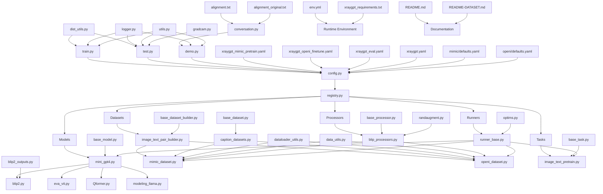

# XRayGPT File Flow Diagram

## 🌊 **COMPLETE SYSTEM FLOW**



## 🔄 **DETAILED EXECUTION FLOWS**

### **1. TRAINING EXECUTION FLOW**
```
┌─────────────┐    ┌─────────────┐    ┌─────────────┐
│   train.py  │───▶│  config.py  │───▶│ registry.py │
└─────────────┘    └─────────────┘    └─────────────┘
        │                   │                   │
        ▼                   ▼                   ▼
┌─────────────┐    ┌─────────────┐    ┌─────────────┐
│ dist_utils  │    │ YAML configs│    │All Components│
│ logger.py   │    │ validation  │    │Registration │
│ utils.py    │    └─────────────┘    └─────────────┘
└─────────────┘            │                   │
        │                   ▼                   ▼
        │          ┌─────────────┐    ┌─────────────┐
        │          │Task Builder │    │Model Builder│
        │          │image_text_  │    │mini_gpt4.py │
        │          │pretrain.py  │    └─────────────┘
        │          └─────────────┘            │
        │                   │                   ▼
        │                   ▼          ┌─────────────┐
        │          ┌─────────────┐    │   blip2.py  │
        │          │Dataset      │    │   eva_vit   │
        │          │Builder      │    │   Qformer   │
        │          └─────────────┘    │modeling_llama│
        │                   │          └─────────────┘
        │                   ▼                   │
        │          ┌─────────────┐            │
        │          │MIMIC/OpenI  │            │
        │          │Datasets     │            │
        │          └─────────────┘            │
        │                   │                   │
        ▼                   ▼                   ▼
┌─────────────────────────────────────────────────────┐
│              runner_base.py                         │
│         (Training Loop Orchestrator)                │
│  ┌─────────────┐ ┌─────────────┐ ┌─────────────┐   │
│  │   Model     │ │  Datasets   │ │Optimization │   │
│  │ Training    │ │  Loading    │ │ & Logging   │   │
│  └─────────────┘ └─────────────┘ └─────────────┘   │
└─────────────────────────────────────────────────────┘
```

### **2. DATASET PROCESSING FLOW**
```
┌─────────────┐    ┌─────────────┐    ┌─────────────┐
│Raw X-ray    │    │filter_cap   │    │Dataset      │
│Images       │───▶│.json        │───▶│Config       │
│(.jpg/.png)  │    │(Annotations)│    │(YAML)       │
└─────────────┘    └─────────────┘    └─────────────┘
        │                   │                   │
        ▼                   ▼                   ▼
┌─────────────┐    ┌─────────────┐    ┌─────────────┐
│Image        │    │Caption      │    │Builder      │
│Processors   │    │Processors   │    │Registration │
│blip_        │    │(Text        │    │(Registry)   │
│processors   │    │Processing)  │    └─────────────┘
└─────────────┘    └─────────────┘            │
        │                   │                   ▼
        ▼                   ▼          ┌─────────────┐
┌─────────────┐    ┌─────────────┐    │image_text_  │
│Augmented    │    │Processed    │    │pair_builder │
│Images       │    │Captions     │    └─────────────┘
│(224x224)    │    │(Tokenized)  │            │
└─────────────┘    └─────────────┘            ▼
        │                   │          ┌─────────────┐
        └───────────────────┼─────────▶│mimic_dataset│
                            │          │openi_dataset│
                            │          └─────────────┘
                            │                   │
                            └───────────────────▼
                                    ┌─────────────┐
                                    │DataLoader   │
                                    │(Batched     │
                                    │ Data)       │
                                    └─────────────┘
```

### **3. MODEL ARCHITECTURE FLOW**
```
┌─────────────┐
│ X-ray Image │
│ (224x224x3) │
└─────────────┘
        │
        ▼
┌─────────────┐    ┌─────────────┐
│ eva_vit.py  │───▶│ Visual      │
│ (MedCLIP    │    │ Features    │
│  Encoder)   │    │ (Frozen)    │
└─────────────┘    └─────────────┘
        │                   │
        ▼                   ▼
┌─────────────┐    ┌─────────────┐
│ Qformer.py  │───▶│ Query       │
│ (32 Query   │    │ Features    │
│  Tokens)    │    │ (Frozen)    │
└─────────────┘    └─────────────┘
        │                   │
        ▼                   ▼
┌─────────────┐    ┌─────────────┐
│Linear       │───▶│ Aligned     │
│Projection   │    │ Features    │
│(Trainable)  │    │ (Trainable) │
└─────────────┘    └─────────────┘
        │                   │
        ▼                   ▼
┌─────────────┐    ┌─────────────┐
│modeling_    │───▶│ Medical     │
│llama.py     │    │ Summary     │
│(Vicuna-7B)  │    │ (Generated) │
└─────────────┘    └─────────────┘
```

### **4. CONFIGURATION CASCADE FLOW**
```
┌─────────────┐
│default.yaml │ (Base Config)
└─────────────┘
        │
        ▼
┌─────────────┐    ┌─────────────┐    ┌─────────────┐
│xraygpt.yaml │    │mimic/       │    │openi/       │
│(Model       │    │defaults.yaml│    │defaults.yaml│
│ Config)     │    │(Dataset)    │    │(Dataset)    │
└─────────────┘    └─────────────┘    └─────────────┘
        │                   │                   │
        └───────────────────┼───────────────────┘
                            ▼
                   ┌─────────────┐
                   │Training     │
                   │Configs:     │
                   │- mimic_     │
                   │  pretrain   │
                   │- openi_     │
                   │  finetune   │
                   │- eval       │
                   └─────────────┘
                            │
                            ▼
                   ┌─────────────┐
                   │config.py    │
                   │(Merged      │
                   │ Final       │
                   │ Config)     │
                   └─────────────┘
```

## 🎯 **KEY INTEGRATION POINTS**

### **Registry System Hub**
- **`registry.py`** connects ALL components
- Every `__init__.py` registers components
- Enables dynamic discovery and instantiation

### **Configuration Management**
- **`config.py`** merges all YAML files
- Validates parameters and paths
- Provides unified configuration interface

### **Training Orchestration**
- **`runner_base.py`** coordinates everything
- Manages distributed training
- Handles checkpointing and logging

### **Data Pipeline**
- **Builders** create datasets from configs
- **Processors** handle image/text preprocessing
- **Datasets** provide batched data to training

This flow diagram shows how all 55 files interconnect to create the complete XRayGPT system!